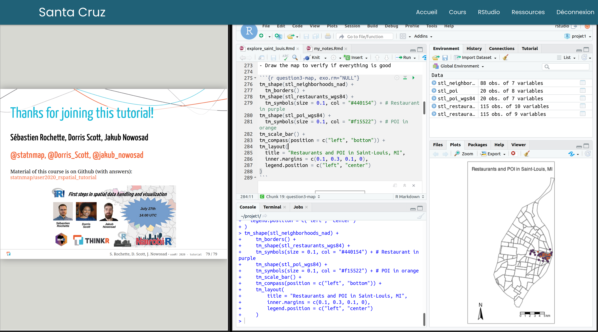

<!-- README.md is generated from README.Rmd. Please edit that file -->

# First steps in spatial handling and visualization

**Instructors: [Sébastien Rochette](https://twitter.com/statnmap),
[Dorris Scott](https://twitter.com/Dorris_Scott), [Jakub
Nowosad](https://twitter.com/jakub_nowosad)**

<!-- badges: start -->

<!-- badges: end -->

## Tutorial purpose

The tutorial is designed for R users from a variety of fields who are
interested in working with spatial data and creating maps with R. No
knowledge of cartography is required. Prior knowledge of (non-spatial)
graphic making and data handling with the {tidyverse} in R is
recommended.

## Content of this repository

  - `slides_user2020_rspatial.pdf`: PDF version of the slides.
  - `data/`: Shapefiles and data used in the slides and in the
    exercises. These data includes a csvs file of restaurants of
    St. Louis and points of interest along with a boundary file of
    St. Louis neighborhoods. Please consult the README document in the
    data folder for more information about the specific datasets.
  - `exo_explore_saint_louis.Rmd`: R markdown file of the exercises.
  - `explore_saint_louis.html`: Output of the exercises when completed.
  - `answers/`: Answers to the tutorial exercises.

## How it was planned

  - **3 instructors**: Sébastien Rochette, Dorris Scott, Jakub Nowosad
  - **3 facilitators**: Shelmith Kariuki, Christopher Maronga, Mark
    Okello
  - **3 hours tutorial**
  - **3 parts**:
      - Tutorial presentation, Draw maps with {tmap}, What are spatial
        data?
      - Read/write spatial vector data, Manipulate vector data with the
        {tidyverse}
      - Manipulate and intersect spatial data
  - **3 times 1 hour**: \~33’ presentation + 2’ quizz + 20’ exercises +
    5’ break
  - **1 e-learning platform** provided by
    [ThinkR](https://rtask.thinkr.fr/remote-trainings-and-certification/)

*Notes for the future:*

  - Knowledge of {dplyr} and manipulation of classical tidy datasets
    prior to the tutorial is necessary.
  - To give this tutorial would require 3.5 hours for attendees to have
    enough practice.
  - “What if the first thing you do when you have problems with your
    spatial dataset?” quizz may require a small discussion. *Although,
    projections will be the source of the majority of your problems…*

## What can you do after this tutorial?

  - Practice again, finish the exercises, and try the BONUS parts. All
    answers are in `answers/` directory, but I am sure you know enough
    to do most of the exercises without the answers. Yes you can\!

  - Have the [Geocomputation with
    R](https://geocompr.robinlovelace.net/) by Robin Lovelace, Jakub
    Nowosad and Jannes Muenchow as a bookmark

  - Find some [spatial tips and examples of maps](https://statnmap.com)
    on my blog: <https://statnmap.com>

  - Follow `#rspatial` on Twitter and ask your questions to the
    community

  - Follow `#RSpatialChat` on Tuesday’s on Twitter lead by
    [@CivicAngela](https://twitter.com/CivicAngela)

  - Join `R4DS` Slack community, there is a `rspatial` channel

  - There is a Telegram group in Spanish: `RSpatial_ES`
